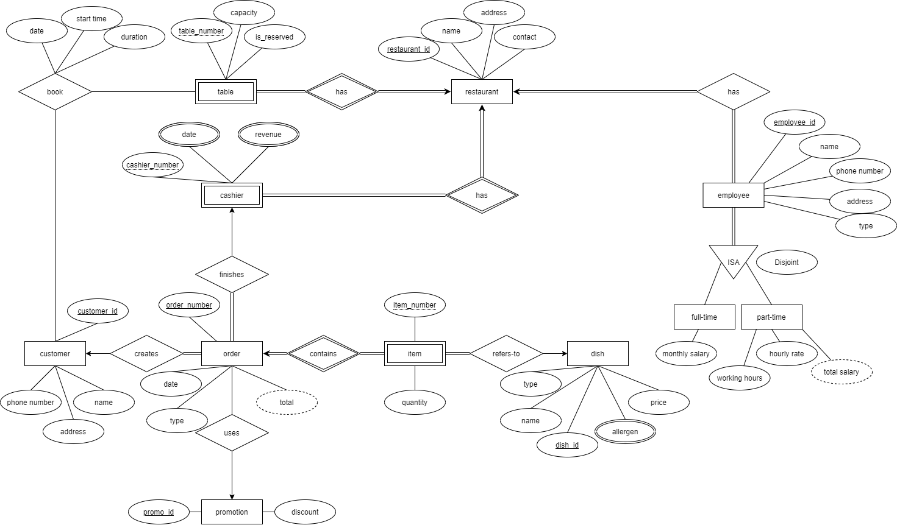

# Restaurant-DBMS
This is the backup of my database design project. The objective of this project is to go through the Database Design Process, so as to put the theory of database modelling and implementation into practice. I chose to design a Restaurant Management System. Below are the ER Model diagram and details of this project. You can view more details in the pdf.
- - - -
**ER Model diagram:**

- - - -
# Topic: Restaurant System #

**Brief Description:**

A system for the restaurant to keep track of customer information, order transactions, and table booking, in addition to standard enterprise information such as human resources and accounting.

**Business rules:**
* Employees can either be full-time employee or part-time employee. For part-time employees, salaries will be paid once in a month by counting their working hours in that month.
* Customers are identified by their unique ID. Each customer has a name, a phone number and an address.
* Each restaurant has its own tables and labelled their tables with table numbers. Table has a capacity and can be reserved.
* Customer can book for a table. The date, start time and duration of the booking will be recorded.
* The restaurant provide a list of dishes to customers. Each dish is identified by a unique ID, has its name, price and a type. The type can be a set, food or drink. The dish could contain multiple allergens.
* When an order is created, it has a unique ID, date, total and type. The type can be dine in or take away.
* Each order contains item(s). Each item is specified by an item number and quantity. The item refers to dish ordered.
* An order can use a promotion. Each promotion is identified by a unique ID and has a discount.
* Every order is completed at cashiers. Each restaurant has its own cashier and labelled their cashiers with casher number. It has a list to show revenue made every day at different cashiers.

**Assumptions:**
* 	Booking a table is not a common practice for the restaurant chain, there won’t be many bookings in a day.
* 	When a table is booked (is_reserved is true), other customers cannot book the same table at that day, even if timeslot does not clash. The table will continue to serve other walk-in customers until time is close to booking start time.
* 	The is_reserved state of tables resets every day. The status is set according to the bookings that the store has in that day.
* 	Customers are required to book a table at least one day before and they can only book one table in a day.
* 	Every day after stores are closed, daily closings of cashiers will be performed. Revenue made by the cashier and the date will be recorded.
* 	Total of an order is calculated by summing the product of item price and quantity, then minus the discount from promotion (if any).
* 	Total salary of part-time employee is calculated by multiplying hourly rate and working hours.
* 	Employees and customers act in rational way.

**System functionalities/user activities:**
* 	Display details of all the stores under the restaurant chain.
* 	Get statistics of order type to see if dine in is more popular of not.
* 	Display the transaction details of all orders created in all stores.
* 	Display the item details of a specific order.
* 	Get statistics of usage of promotion to see if the promotion is successful or not.
* 	Show the tables booked for a specific day in a specific store.
* 	Show all the upcoming bookings of a specific store.
* 	Display details of all customers who have never create an order in any store.
* 	Display details of all employees working in a specific store.
* 	Show monthly salaries of all full-time employees working in a specific store.
* 	Show salaries of all part-time employees working in a specific store.
* 	Find the revenue records of all cashiers of a specific store.
* 	Find the revenue made by a specific store in a specific day.
* 	Show the number of cashiers owned by each store.
* 	Find the number of orders that a specific customer has placed.
* 	Display the total number of orders created by each store and their respective total revenue generated.
* 	List details of all dishes that contain allergens.
